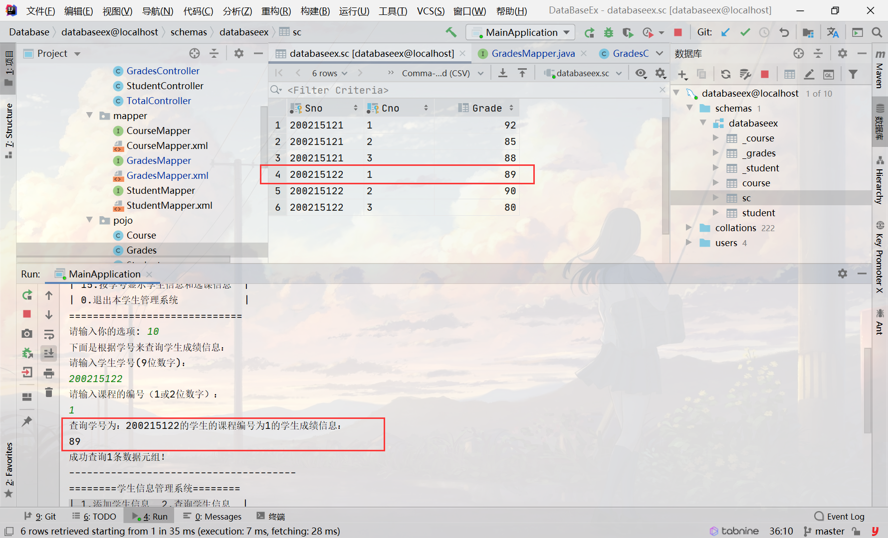
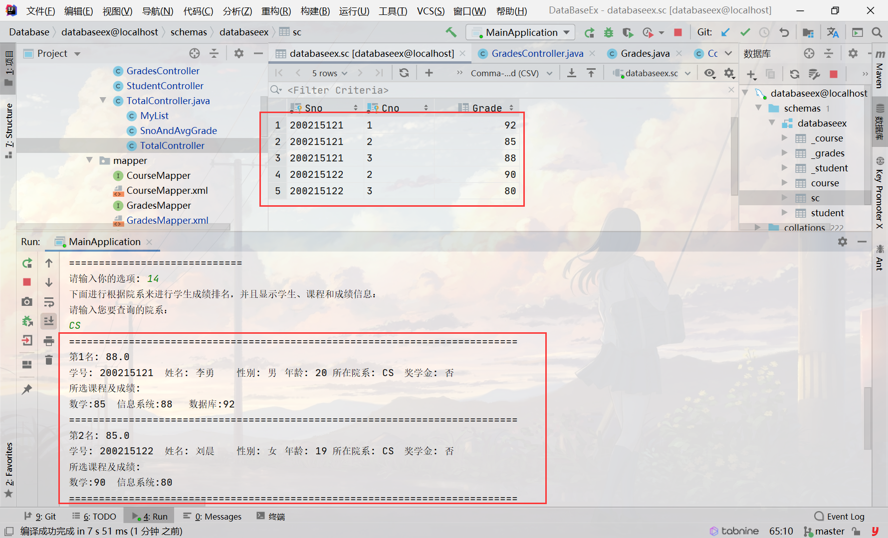

# 数据库实验

## 实验环境：

> * `java`：`jdk11.0.11`
> * `mysql`驱动：`mysql-connector-java-8.0.22.jar`
> * `mysql`数据库：`MySQL Server 5.7`
> * 操作系统：`Windows 10`
> * 框架：`mybatis 3.5.2`

## 起步配置

mybatis-config.xml中properties修改：

```XML
driver=com.mysql.cj.jdbc.Driver
url=
username=root
password=
```

更多mybatis学习请看：[mybatis学习笔记](https://github.com/ferapontqiezi/DataBaseEx/blob/master/mybatis.pdf)

## 数据库说明

创建三个表：

**Student**

```mysql
create table Student(
    Sno CHAR(9) PRIMARY KEY,
    Sname CHAR(20) UNIQUE,
    Ssex CHAR(2),
    Sage SMALLINT,
    Sdept CHAR(20),
    Scholarship char(2)
    );

```

**Course**

```mysql
create table Course(
    Cno CHAR(4) PRIMARY KEY,
    Cname CHAR(40),
    Cpno CHAR(4),
    Ccredit SMALLINT,
    FOREIGN KEY (Cpno) REFERENCES Course(Cno)
    );
```

**SC**

```mysql
create table SC(
    Sno CHAR(9),
    Cno CHAR(4),
    Grade SMALLINT,
    PRIMARY KEY (Sno, Cno),
    FOREIGN KEY (Sno) REFERENCES Student(Sno),
    FOREIGN KEY (Cno) REFERENCES Course(Cno)
    );
```

现在数据库有三个表，Student、Course、Grades，各个表的字段信息如下：

**Student**

~~~sql
+-------------+----------------+-----------+
| COLUMN_NAME | COLUMN_COMMENT | DATA_TYPE |
+-------------+----------------+-----------+
| Sno         |  Primary Key   | char(4)   |
| Sname       |    Unique      | char(40)  |
| Ssex        |                | char(4)   |
| Sage        |                | smallint  |
| Sdept       |                | char(20)  |
| Sscholarship|                | char(2)   |
+-------------+----------------+-----------+
~~~

**Course**

~~~mysql
+-------------+----------------+-----------+
| COLUMN_NAME | COLUMN_COMMENT | DATA_TYPE |
+-------------+----------------+-----------+
| Cno         |  Primary Key   | char(4)   |
| Cname       |                | char(40)  |
| Cpno        |  Foreign Key   | char(4)   |
| Ccredit     |                | smallint  |
+-------------+----------------+-----------+
~~~

**SC**

~~~sql
+-------------+----------------+-----------+
| COLUMN_NAME | COLUMN_COMMENT | DATA_TYPE |
+-------------+----------------+-----------+
| Sno         |                | char(9)   |
| Cno         |                | char(4)   |
| Grade       |                | smallint  |
+-------------+----------------+-----------+
~~~

## 应用预览

其实就是一个while循环里嵌套一个switch，实现一个命令行菜单.

实现功能：

**学生类**
1.新生入学信息增加  2.学生信息删除  3.查询所有学生信息  4.学生信息修改
**课程类**
5.增加新课程  6.删除没有选课的课程信息  7.查询课程信息  8.修改课程信息
**学生成绩类**
9.录入学生成绩  10.删除学生成绩  11.查询所有学生成绩  12.修改学生成绩
**其他**
13.院系学生成绩统计  14.学生成绩排名  15.查询学生基本信息和选课信息  0.退出

## 调用逻辑

其中第14号功能逻辑如下：


其中第15号功能逻辑如下：


## 预览效果

功能1


功能2


功能3


功能4


功能5


功能6


功能7


功能8


功能9


功能10



功能11


功能12


功能13


功能14



功能15


## 总结

万分感谢[@H同学](https://github.com/AHawkeye)的帮助！他写的实验比我有条理多了！[他的数据库repo](https://github.com/AHawkeye/DataBaseLab)

- 写数据库实验记住一定要分层！我没写Service层的接口，导致各种Controller互相调用~~写的实在是麻了~~
- 要熟练使用Mybatis的使用

